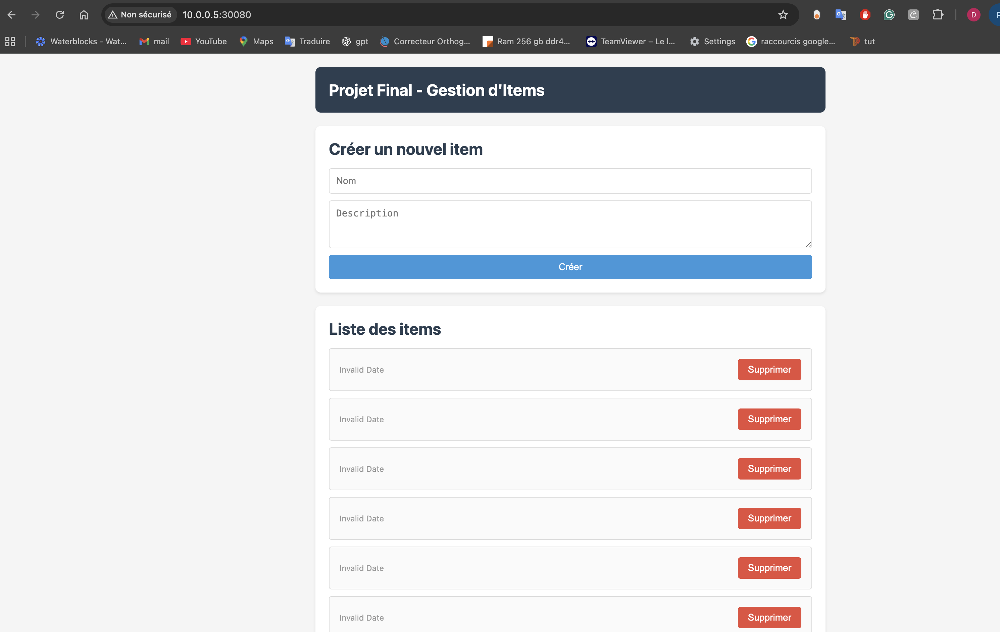

# Projet Final - Déploiement 3-tiers sur Kubernetes

Application 3-tiers (Frontend + Backend + Database) déployée sur Kubernetes.

## Architecture

Internet → Ingress → Front Service → Front Pods (2 replicas)
                  → Back Service  → Back Pods (2 replicas) → DB Service → DB Pod

Composants:
- Frontend: Vue.js SPA avec nginx
- Backend: Node.js API REST
- Database: PostgreSQL 15 avec PVC persistant
- Ingress: NGINX Ingress Controller


## Installation

### 1. Générer les secrets

```bash
./scripts/generate-secrets.sh
```

Sauvegardez le mot de passe DB affiché.

### 2. Construire et pousser les images Docker

Se connecter à Docker Hub:
```bash
docker login
```

Construire et pousser les images:
```bash
./scripts/build-and-push.sh 
```

Les images sont maintenant sur Docker Hub:
- dreasy/projetkubem2-back:latest
- dreasy/projetkubem2-front:latest

### 3. Déployer

```bash
./scripts/deploy.sh
```

Ou manuellement:
```bash
kubectl apply -f k8s/
```

### 4. Vérifier

```bash
kubectl get pods -l app=projet-final
kubectl get services -l app=projet-final
kubectl get ingress
```

## Structure du projet

```
kube-m2/
├── app/
│   ├── backend/
│   │   └── Dockerfile
│   └── frontend/
│       ├── Dockerfile
│       └── nginx.conf
├── k8s/
│   ├── back-config-secret.yml
│   ├── back-deployment.yml
│   ├── db-deployment.yml
│   ├── db-pvc.yml
│   ├── db-secret.yml
│   ├── front-deployment.yml
│   ├── front-ingress.yml
│   ├── hpa-back.yml
│   ├── hpa-front.yml
│   ├── cert-manager-issuer.yml
│   ├── front-ingress-tls.yml
│   └── metrics-server.yml
├── kustomize/
│   ├── base/
│   └── overlays/
│       ├── dev/
│       └── prod/
├── scripts/
│   ├── generate-secrets.sh
│   ├── build-and-load.sh
│   └── deploy.sh
└── docs/
    ├── architecture.md
    ├── runbook.md
    ├── security.md
    └── hpa-tls-observability.md
```

## Commandes utiles

```bash
kubectl get pods -l app=projet-final
kubectl logs -l tier=back --tail=50 -f
kubectl logs -l tier=front --tail=50 -f
kubectl scale deployment/back-deployment --replicas=3
kubectl rollout undo deployment/back-deployment
kubectl port-forward svc/front-service 8080:80
```

## Documentation

- architecture.md: Diagrammes et architecture détaillée
- runbook.md: Déploiement, rollback, troubleshooting
- security.md: Gestion secrets, RBAC, bonnes pratiques
- hpa-tls-observability.md: HPA, TLS, Kustomize

## Fonctionnalités avancées

HPA: Scaling automatique (hpa-back.yml, hpa-front.yml)
TLS: Certificats SSL automatiques (cert-manager, front-ingress-tls.yml)
Kustomize: Multi-environnements (kustomize/overlays/)

Voir docs/hpa-tls-observability.md pour détails.


### Deploy 

```bash
[root@master kube-m2]# kubectl get nodes
NAME                    STATUS     ROLES           AGE   VERSION
localhost.localdomain   NotReady   control-plane   28d   v1.30.14
worker1                 Ready      <none>          28d   v1.30.14
worker2                 Ready      <none>          28d   v1.30.14
worker3                 Ready      <none>          28d   v1.30.14

[root@master kube-m2]# bash scripts/deploy.sh 
secret/db-secret created
configmap/back-config created
secret/back-secret created
persistentvolumeclaim/db-pvc created
deployment.apps/postgres-db-deployment created
service/postgres-db-service created
error: timed out waiting for the condition on pods/postgres-db-deployment-5956c7fd86-lvk5r
deployment.apps/back-deployment created
service/back-service created
deployment.apps/front-deployment created
service/front-service created
ingress.networking.k8s.io/front-ingress created
horizontalpodautoscaler.autoscaling/back-hpa created
horizontalpodautoscaler.autoscaling/front-hpa created


kubectl get services -l app=projet-final
NAME                                      READY   STATUS             RESTARTS      AGE
back-deployment-58fc464c68-7mw8w          1/1     Running            0             10m
back-deployment-58fc464c68-lvdl7          1/1     Running            0             10m
back-deployment-d46bdf8c8-xj4h4           1/1     Running            0             14m
front-deployment-65d8c46d7c-9xzd5         1/1     Running            6 (11m ago)   14m
front-deployment-65d8c46d7c-l4q2q         1/1     Running            0             8m14s
postgres-db-deployment-5956c7fd86-zxns6   0/1     Pending            0             5m53s
NAME                     TYPE        CLUSTER-IP       EXTERNAL-IP   PORT(S)        AGE
back-service             ClusterIP   10.98.151.185    <none>        80/TCP         86m
front-service            ClusterIP   10.106.172.119   <none>        80/TCP         86m
front-service-nodeport   NodePort    10.104.31.252    <none>        80:30080/TCP   109s
postgres-db-service      ClusterIP   10.98.27.64      <none>        5432/TCP       88m
[root@master kube-m2]# kubectl get svc front-service-nodeport
NAME                     TYPE       CLUSTER-IP      EXTERNAL-IP   PORT(S)        AGE
front-service-nodeport   NodePort   10.104.31.252   <none>        80:30080/TCP   2m4s
````
### Accéder à l'application

```bash
http://localhost:30080/
```


Acces OK a l'appication qui tourne sur le cluster Kubernetes séparé sur 3 nodes et le master sous Rocky Linux.